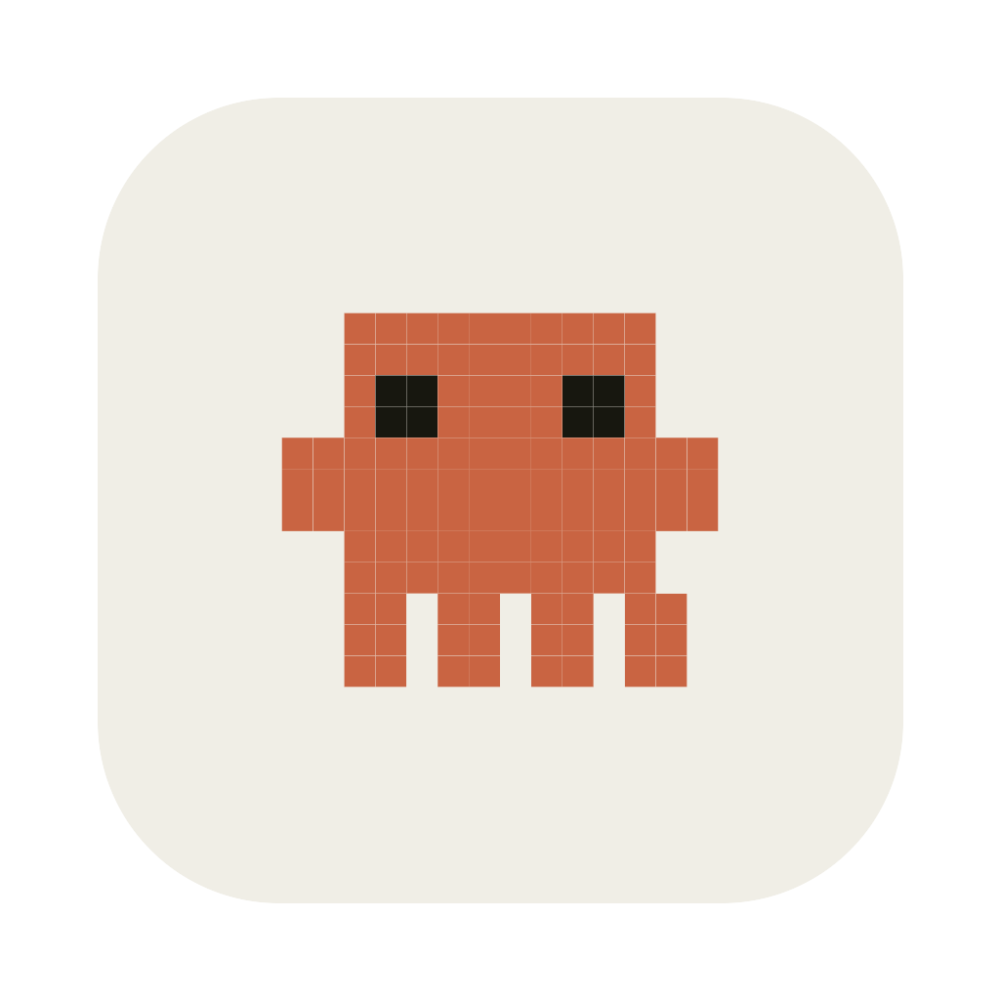
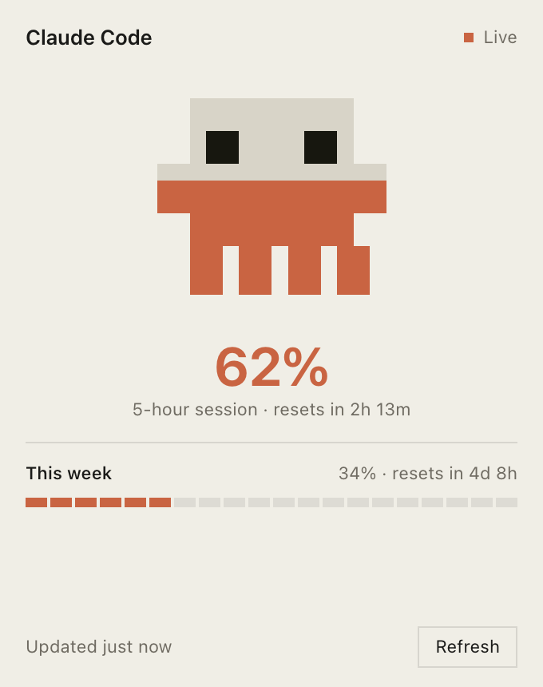

<p align="center">
  
</p>

<h1 align="center">Claude Tracker</h1>

<p align="center">
  <strong>See your Claude Code limits before they stop you.</strong><br>
  <a href="https://claude-tracker.bhargavdetroja.com/">claude-tracker.bhargavdetroja.com</a>
</p>

<p align="center">
  
  
  
</p>

<p align="center">
  
</p>

A small macOS menu bar app that shows how much of your Claude Code session and
weekly allowance you have spent, drawn as a little creature who fills up from
his feet as you work. It checks once every sixty seconds.

- **Both windows at once.** The rolling five hour session and the seven day
  allowance, each with a live countdown to the moment it resets.
- **At a glance.** The menu bar icon fills as you spend, with the exact figure
  beside it. You never have to open anything to know where you stand.
- **Your token stays put.** Read from the macOS Keychain and sent only to
  Anthropic. No account, no telemetry, no server in between.
- **Honest when it breaks.** If a check fails it keeps your last reading and
  marks it stale, rather than showing you a confident zero.

---

## Contents

- [Why this is open source](#why-this-is-open-source)
- [Requirements](#requirements)
- [Build it](#build-it)
- [The first launch](#the-first-launch)
- [Configuration](#configuration)
- [How it works](#how-it-works)
- [The icon](#the-icon)
- [Project layout](#project-layout)
- [Development](#development)
- [Troubleshooting](#troubleshooting)
- [Contributing](#contributing)
- [License](#license)

---

## Why this is open source

Claude Tracker needs the OAuth token that Claude Code already stored on your
Mac. That token lives in the macOS Keychain, and macOS will ask your permission
the first time it is read.

**An app that asks for a credential owes you the ability to check what it does
with it.** So every line that touches your token is here to read. The whole of
the credential handling is one shell command and one HTTPS request:

```bash
# ask macOS for the token Claude Code saved
security find-generic-password -s "Claude Code-credentials" -w

# then one request, straight to Anthropic
GET https://api.anthropic.com/api/oauth/usage
  Authorization: Bearer <that token>
  anthropic-beta: oauth-2025-04-20
```

Nothing is stored, nothing is forwarded, and there is no server of this
project's anywhere in the path. Two short files do all of it:

| File | What it does |
| --- | --- |
| [`ClaudeCredentialStore`](app/Services/ClaudeCredentialStore.php) | Reads the token from the Keychain and checks it has not expired |
| [`ClaudeUsageClient`](app/Services/ClaudeUsageClient.php) | Makes the one request and parses the response defensively |

Read them before you run this. They are the point.

---

## Requirements

| | |
| --- | --- |
| **macOS** | The credential read uses the macOS Keychain and the icon is a macOS template image |
| **[Claude Code](https://claude.com/claude-code)** | Installed and signed in. The app has no login of its own, it borrows the credentials Claude Code already stored |
| **PHP 8.3+** | With the `gd` extension, used to draw the menu bar icon |
| **Composer** | |
| **Node 18+ and npm** | Used by NativePHP to package the Electron app |

Check your PHP is suitable:

```bash
php -v                    # 8.3 or newer
php -m | grep -x gd       # should print: gd
```

---

## Build it

There is no signed release. You build the app yourself, which takes about a
minute and produces an app macOS opens without any warning.

```bash
git clone https://github.com/BhargavDetroja/claude-tracker.git
cd claude-tracker

composer setup
```

`composer setup` runs the whole first time setup for you:

1. `composer install` — PHP dependencies
2. copies `.env.example` to `.env` if you do not have one
3. `php artisan key:generate` — application key
4. `php artisan migrate --force` — the local SQLite database

There is no front end build step. The panel is a single self contained Blade
view with its own styles, so there is no bundler in this project. NativePHP
handles the Electron side's own dependencies during `native:build`.

Then build the desktop app:

```bash
php artisan native:build
```

The finished app is written to:

```
nativephp/electron/dist/
├── mac-arm64/Claude Tracker.app      # Apple silicon
├── mac/Claude Tracker.app            # Intel
└── Claude Tracker-1.0.0-arm64.dmg
```

Drag `Claude Tracker.app` into your Applications folder and open it. It appears
in the menu bar, not the Dock. The first poll happens immediately, and macOS
will ask once for permission to read the Keychain entry.

To run it straight from source while you work on it:

```bash
php artisan native:serve
```

---

## The first launch

If you download a build rather than making one yourself, macOS will say it
**cannot check the app for malware**.

That warning appears for any app Apple has not notarized, which requires a paid
Apple developer account this project does not have. It is the absence of a
receipt from Apple, not a finding about the app.

To open it the first time:

1. Right click `Claude Tracker.app` in Finder
2. Choose **Open**
3. Confirm

macOS remembers the decision and will not ask again.

An app you build yourself carries no quarantine flag and opens with no warning
at all, which is the better route if you would rather not click past a security
dialog for something that reads your Keychain.

---

## Configuration

Everything lives in [`config/claude.php`](config/claude.php) and can be
overridden from `.env`.

| Setting | Environment variable | Default |
| --- | --- | --- |
| Keychain service name | `CLAUDE_KEYCHAIN_SERVICE` | `Claude Code-credentials` |
| Usage endpoint | `CLAUDE_USAGE_ENDPOINT` | `https://api.anthropic.com/api/oauth/usage` |
| Beta header | `CLAUDE_OAUTH_BETA` | `oauth-2025-04-20` |
| Request timeout, seconds | `CLAUDE_REQUEST_TIMEOUT` | `10` |
| Which window drives the icon | `CLAUDE_MENU_BAR_METRIC` | `five_hour` |
| Generated icon cache | `CLAUDE_ICON_PATH` | `storage/app/menubar` |

`CLAUDE_MENU_BAR_METRIC` accepts `five_hour`, `seven_day` or `highest`. Use
`highest` if you would rather the icon always show whichever limit is closest.

**Polling interval.** The schedule is one line in
[`routes/console.php`](routes/console.php). It runs every minute by default.
`everyThirtySeconds()` also works, at the cost of one long lived PHP process,
because Laravel keeps the scheduler alive for the whole minute to service sub
minute tasks.

---

## How it works

A supervised background process, `claude:watch`, checks once a minute. It:

1. Reads the OAuth token from the Keychain under `Claude Code-credentials`.
2. Asks Anthropic for your usage, using the same endpoint Claude Code calls for
   its own usage display.
3. Caches the reading, repaints the menu bar icon and label, and pushes the new
   figures to any open panel over IPC.

The panel also re reads the local cache every fifteen seconds while it is open,
so it stays current even if an IPC message is missed. That read never leaves
your machine.

### Why a child process rather than the scheduler

NativePHP drives Laravel's scheduler from a timer in Electron's main process.
For a menu bar app with no visible window that timer is a poor bet: macOS App
Nap is free to throttle it, and NativePHP deliberately stops the scheduler when
the machine sleeps, restarting it only if the resume event arrives cleanly.

`claude:watch` runs as a persistent child process instead. It is not the UI
process, so App Nap does not target it, a sleeping machine simply pauses it,
and NativePHP restarts it if it ever dies. The scheduler still runs alongside as
a fallback, and both call `pollIfStale()`, so whichever fires first does the
work and the other backs off rather than doubling the requests to Anthropic.

### About that endpoint

The usage figures come from an endpoint Anthropic has **not documented or
published**. It could change shape, or stop answering, with no notice.

The parser is built expecting exactly that. Every field is treated as optional,
each figure is looked for in two places (the named `five_hour` and `seven_day`
objects, and the parallel `limits` array), and a response it cannot recognise is
treated as a failure that keeps your last good reading rather than a success
that reports zero.

---

## The icon

The character is defined once, as a grid of characters in
[`PixelMascot`](app/Services/PixelMascot.php):

```
'...BBBBBBBBBB...',
'...BEEBBBBEEB...',   B = body, E = eye, . = empty
'.BBBBBBBBBBBBBB.',
'...BB.BB.BB.BB..',
```

That one grid is rasterised three ways, so the icon and the panel can never
disagree:

- **The menu bar icon**, drawn to PNG by
  [`MenuBarIconRenderer`](app/Services/MenuBarIconRenderer.php) as a macOS
  *template image*, meaning it carries only alpha and macOS tints it to match a
  light or dark menu bar. Pixel art is deliberate here: every cell lands on a
  whole device pixel, so nothing blurs at 16pt the way an antialiased vector
  does. He fills from his feet up as the session is spent.
- **The panel**, as SVG rectangles from the same grid.
- **The app icon**, `public/icon.png`, at 1024 x 1024 with the macOS safe area.

To change the character, edit the grid and bump `RENDER_VERSION` in
`MenuBarIconRenderer` so cached icons regenerate.

The app icon is copied into the build from `public/icon.png`. Replace that file
to change it.

---

## Project layout

```
app/
├── Console/Commands/PollClaudeUsage.php   the scheduled command
├── Events/UsageUpdated.php                broadcast to the panel over IPC
├── Http/Controllers/DropdownController.php
├── Providers/NativeAppServiceProvider.php menu bar wiring
└── Services/
    ├── ClaudeCredentialStore.php          reads the Keychain
    ├── ClaudeUsageClient.php              calls the usage endpoint
    ├── UsageSnapshot.php                  immutable reading, defensive parsing
    ├── UsagePoller.php                    poll, cache, repaint, broadcast
    ├── PixelMascot.php                    the character grid
    └── MenuBarIconRenderer.php            grid to template PNG

resources/views/dropdown.blade.php         the panel
routes/console.php                         the schedule
config/claude.php                          settings
```

---

## Development

```bash
php artisan test            # the suite
vendor/bin/pint             # formatting
composer dev                # run the desktop app from source
php artisan native:serve    # the same thing, spelled out

php artisan claude:poll-usage   # one poll, straight from the terminal
```

`claude:poll-usage` works outside the desktop app too. The menu bar calls are
guarded, so running it in a plain terminal prints your usage and skips the
repaint.

---

## Troubleshooting

**The app says it cannot read the Keychain.** Open Claude Code and make sure you
are signed in. The entry only exists once you have.

**The figures never change.** Check the app is actually running, then look at
`~/Library/Application Support/claude-tracker/storage/logs/`. An `HTTP 429` in
there means Anthropic rate limited the request, usually because several copies
were polling at once.

**macOS reports the app as damaged.** Rebuild it. This happens when something
writes inside a signed `.app` bundle after it was signed.

**`Error: Electron uninstall` when running `native:serve` or `native:build`.**
Electron downloads its binary in a postinstall script, and this project's root
`.npmrc` sets `ignore-scripts=true`. If that ever leaks into the Electron
folder, npm installs the package without its binary. Fix it with:

```bash
cd nativephp/electron && node node_modules/electron/install.js
```

`nativephp/electron/.npmrc` sets `ignore-scripts=false` to prevent this.

**Nothing appears in the menu bar.** The app has no Dock icon by design. Look at
the right hand end of the menu bar.

---

## Contributing

Issues and pull requests are welcome. Please run the suite and the formatter
before opening one:

```bash
php artisan test && vendor/bin/pint
```

If you are changing anything that touches the token, say so plainly in the pull
request description. That part of the codebase is the reason this project is
public, and it should stay easy to audit.

---

## License

[MIT](LICENSE). Do what you like with it.

## Not affiliated with Anthropic

This is an independent project. It is not affiliated with, endorsed by, or
supported by Anthropic. "Claude" and "Claude Code" are their trademarks, and the
usage endpoint it reads is undocumented and may change at any time.
